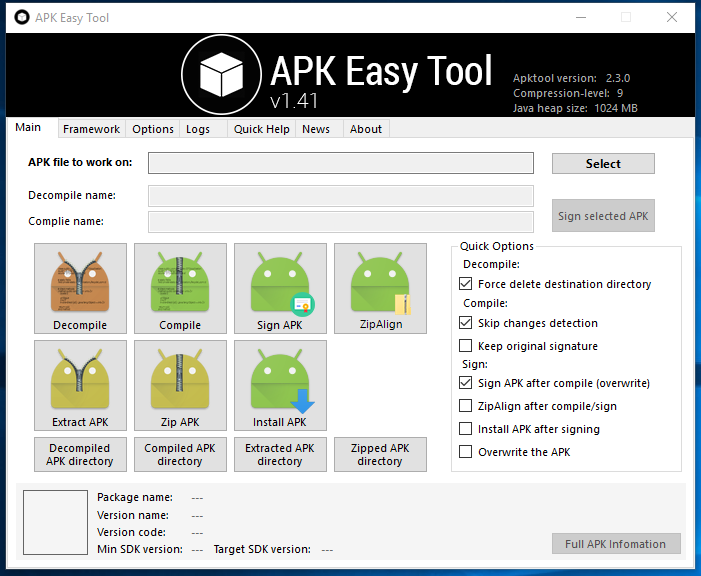
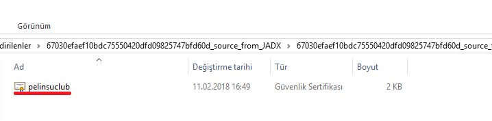
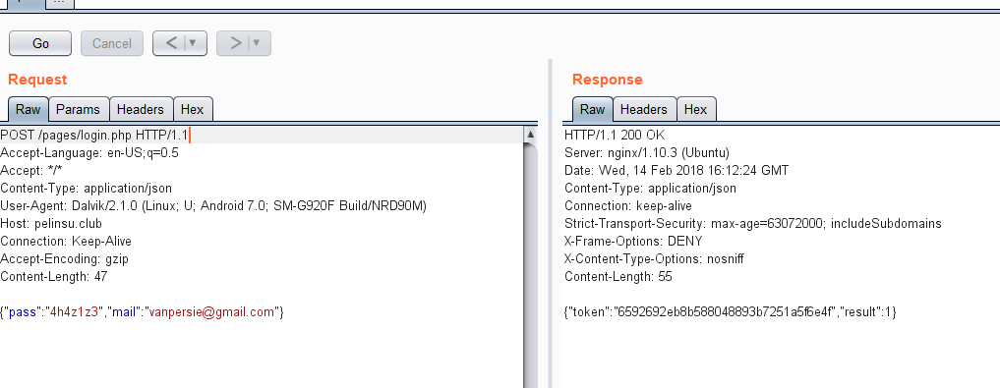
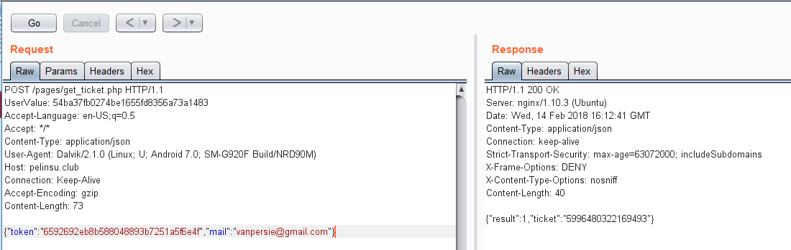
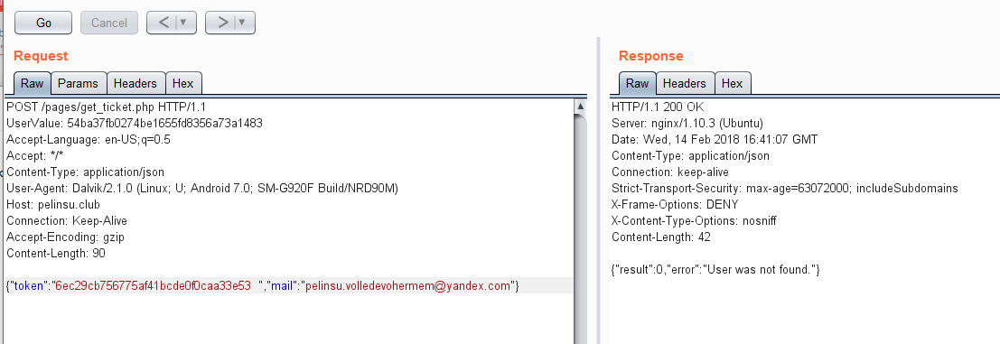
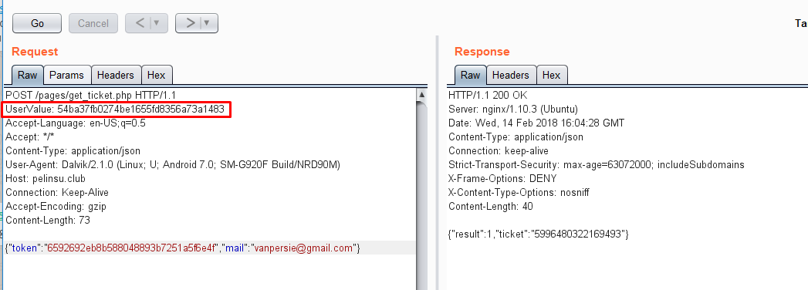
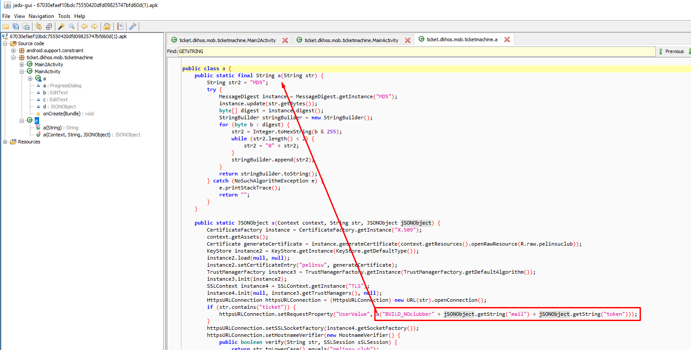
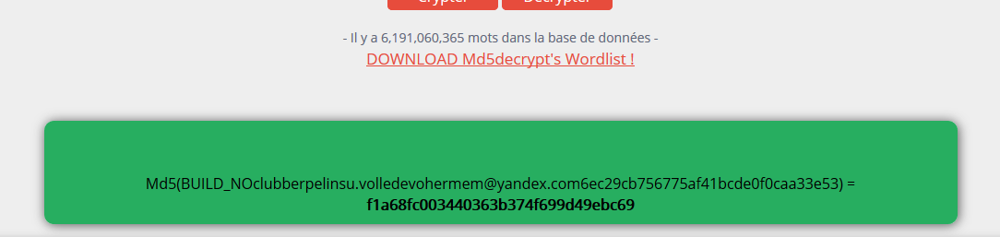
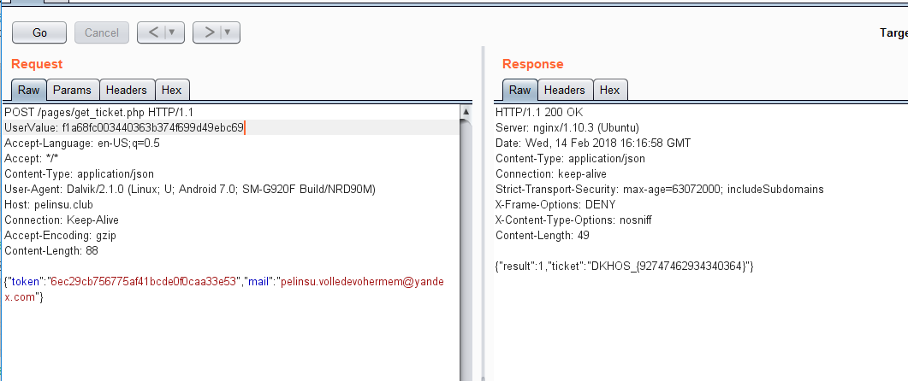

#     SORU
Zabaha kadar dans
Pelinsu Hollanda'da bir club'a giriş için önceden biletini almış. Bilet numarası belki Mahmut için faydalı bir bilgi olabilir.

Mahmut'un araştırmasına göre Pelinsu'nun çocukluk arkadaşı Robin Van Persie de bu etkinliğe gidecekmiş. 

Mahmut Vanpersie'nin e-mail ve parolasını biliyordu zaten:

vanpersie@gmail.com:4h4z1z3
Pelinsu'nun eski cep telefonundan çıkan uygulama ile bilet numarasına ulaşmayı denemeliydi...

#     SSL UNPINNING
Uygulamanın gönderdiği requestleri tam olarak görüntüleyebilmek ve manipüle etmek için bir proxy ile izlememiz gerekiyordu fakat telefonda https requestleri için genel bir CA sertifikası olsa da uygulama requestleri SSL Pinning ile doğruladığından requestleri izleyemiyorduk.

Uygulamayı Apk Easy Tool ile decompile ettik.

sonra res/raw klasörü içerisindeki sertifikanın içeriğini kullandığımız proxy yazılımının oluşturduğu CA sertifikasıyla değiştirip

Uygulamamızı tekrar compile ettikten sonra proxy yazılımımız ile http requestlerini izleyebilir duruma geldik.

#     Requestler

Uygulamadan 2 farklı request gidiyordu

login.php

ve get_ticket.php

login.phpnin response'ndan aldığımız md5 hashini decrypt ettik

hemen aklımıza tam zıttı olan blackbox geldi

blackboxın md5'ini alıp yollamayı denedik.

sonuç hüsran

Daha sonra login.phpde UserValue'yu farkettik

Uygulama login.php'den sonra serverdan herhangi bi veri istediğinde bulunmuyordu.
IDORumsu bi zafiyet kısaca.

uygulamayı incelemek için jdax kullandık.

Uygulama uservalue'yu md5("BUILD_NOclubber"+mail+token) şeklinde oluşturuyordu.

Maili biliyorduk tokenında md5(blackbox) olcağını tahmin ediyorduk.Geriye hepsini birleştirip md5ini hesaplamak kalıyordu

hesapladıktan sonra get_ticket.php ye göndericeğimiz isteği değiştirdik.

ve sonuda bayrağa ulaştık.
