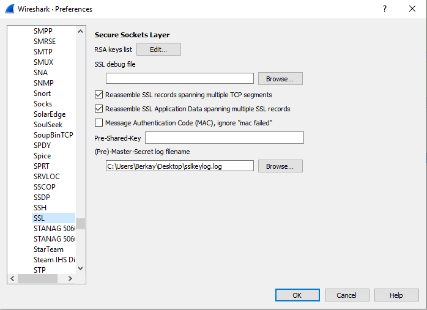
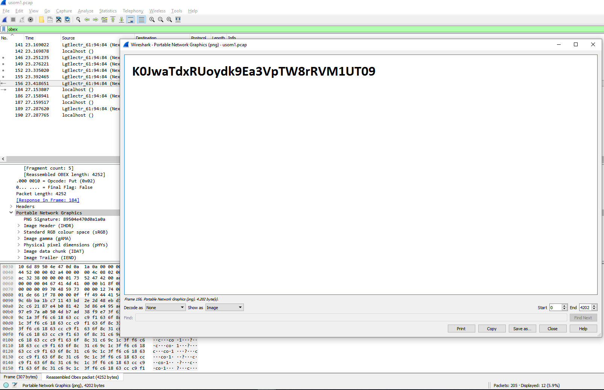
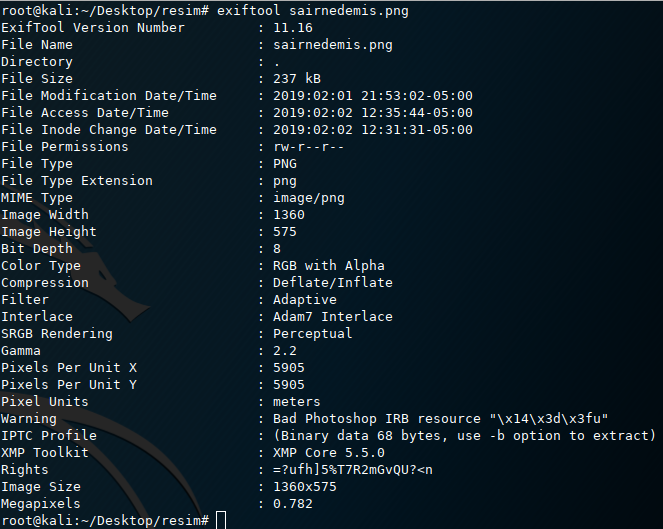

# Siber Yıldız 2019 Writeup

## HTTPS Network Pcap

[Pcap Dosyası](network-150.pcap)

Dosyayı wireshark incelediğimizde HTTP requestleri arasında sslkeylog.log dosyası dikkatimizi çekiyor içerisinde 

> SSL/TLS secrets log file, generated by NSS CLIENT_RANDOM
> 3c059964842e18ec3b9c53849f09efd9d1108d642b7924193e55f08555858758
> 27f60b710d7835657c6d5fe36b6bc1f340a71df91226542bbf296c15a939be9e617e7a94662bfdbc190bf9b69f44f4ad

Bu dosya wireshark ayarlarını aşağıdaki şekilde değiştirerek HTTPS (SSL/TLS) trafiğini decryt etmemizi sağlıyor.

HTTP trafiğini tekrar kontrol ettiğimizde yeni bir HTTP isteği dikkatimizi çekiyor bir [.pkt dosyası](network-150.pkt)! 
Dosya url adresini alıp ctf sunucusunda aynı url ile dosyamızı indiriyoruz.
Dosya bir Cisco packet tracer dosyası dosyayı inceliyoruz sunucuların içerisindeki html dosyalarını vs geziyoruz hiç bir şey yok sonra routerın ayar dosyasını export ediyoruz [Router1_running-config.txt](Router1_running-config.txt) dosya içerisinde 
`username usom password 7 0200085A0C5C022519061B49100317193C2439386D`
satırından parola bilgisini alıyor http://www.ifm.net.nz/cookbooks/passwordcracker.html adresinden Type 7 Password decode ediyoruz

    flag:md5(r0uterP@ss)
Sonra md5 alıp bayrağı kapıyoruz.

## Bluetooth Pcap
[Pcap Dosyası](usom1.pcap)
Bir bluetooth pcap dosyası olduğunu farkediyoruz bir dosya gönderildiğini anlıyor başta giden byte'ları tek tek analiz edip PNG magic byte tan sonra kopyalayarak image render etmeye çalıştım fakat sonra çok daha kolay bir yöntem olduğunu farkettim.

Filter kısmına OBEX yazdıktan sonra 156 nolu paketten Portable Network Graphics kısmından export alarak bayrağımızı alabiliyoruz.

## HASH

0827206450376af3dce61d788ddeba21f58dba35257fdb43c1872c096a36287f

Soruyu açtığımızda sadece yukarıdaki hash'i görüyoruz. Hash i google da arattığımda hiç bir şey yok sonra bunun virustotal hash i olabildiğini düşünüp kontrol ettiğimde dosyaya ulaşıyorum. Dosya ve parolası da community kısmında paylaşılmış dosya bir apk dosyası. [Apk Dosyası](puzzles.apk)
Dosya boyutunun büyük olması şüphe uyandırıyor kodları kontrol etmekle zaman kaybetsem de drawable/ klasörünün altındaki resimleri buluyorum. [Resimler](resim.rar)
Dosyalara binwalk ile baktığımızda hepsi .zip içeriyor tek tek hepsini çıkarttıktan sonra sha1sum ile farklı olan zip dosyasını tespit edip açmayı deniyoruz ama parola korumalı olduğundan açamıyoruz bruteforce denemesi yapıyorum fakat sonuç alamıyorum. Sonra takım arkadaşımın exiftool da parolayı yakalamasının ardından

    =?ufh]5%T7R2mGvQU?<n

 dosyamız içerisinden hadibul.b64 dosyasını dosya uzantısından base64 encoded olduğunu tahmin edip CyberChef ten decode ediyoruz dosyamızı file komutuyla incelediğimizde apk dosyası olduğunu keşfedip apk yı telefonumuza yüklüyoruz java kodunu anlayıp butona 5 kere tıklayarak bayrağı alıyoruz.
